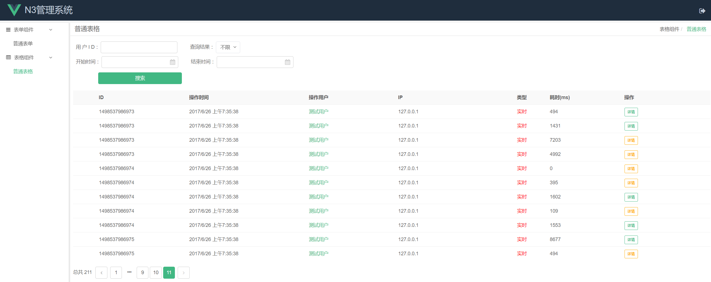
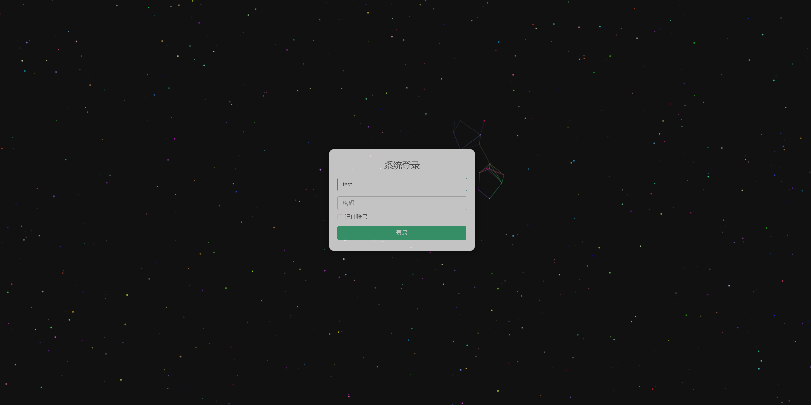
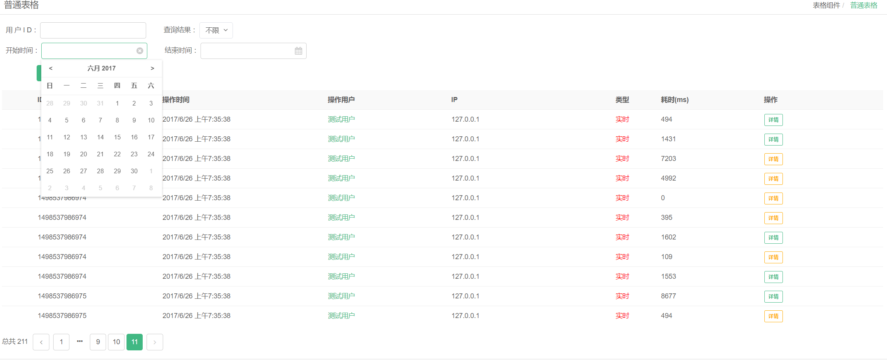
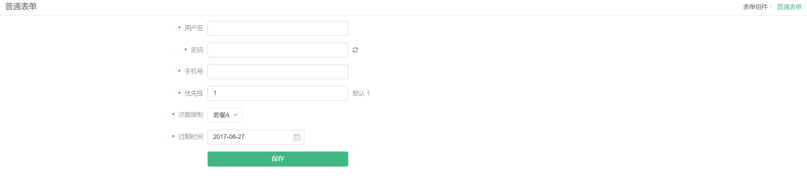

# N3-admin

vue / vuex / vue-router / N3 /axios

简述
---

本项目基于N3-components提供基本组件，是入门vue全家桶较全面的demo，同时也是一套可用的Admin模板。


使用说明
---

+ 开发环境

```
npm run dev
```

+ 生产环境

```
npm run build
```

效果图
---

+ 总览



+ 登录



+ Table



+ Form


